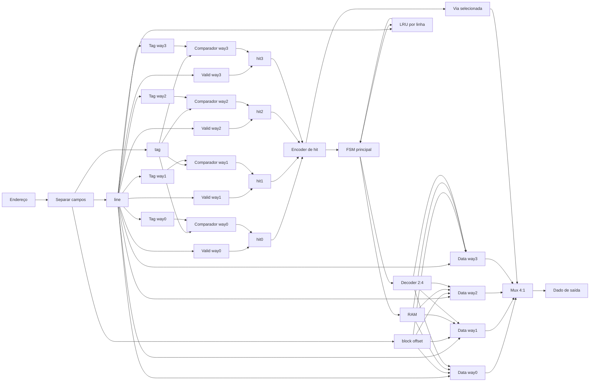

# Datapath da cache / Cache datapath

## Português

O datapath abaixo mostra o fluxo de uma leitura na cache `4-way`.

Versão visual editável no Inkscape: [`assets/cache4way_datapath.svg`](../assets/cache4way_datapath.svg).
Documentação dos marcadores dinâmicos: [`docs/inkscape-drawing.md`](inkscape-drawing.md).

Fluxo em caso de `hit`:

1. O endereço é separado em `tag`, `line` e `block offset`.
2. A `line` seleciona uma posição em cada uma das quatro vias.
3. A `tag` é comparada com as tags armazenadas.
4. `hit_bits[i] = comparator[i] & valid[i]`.
5. O encoder escolhe a via que acertou.
6. O mux 4:1 retorna o dado da via escolhida.
7. A política LRU é atualizada.

Fluxo em caso de `miss`:

1. A FSM detecta que nenhum `hit_bit` está ativo.
2. A cache escolhe primeiro uma via inválida, se existir.
3. Se todas as vias forem válidas, a cache escolhe a via com idade LRU `3`.
4. A RAM fornece todos os bytes do bloco.
5. A cache grava dados, tag, bit valid e atualiza LRU.

## English

The diagram above shows the read datapath for the `4-way` cache.

On a `hit`, the address is split into `tag`, `line`, and `block offset`; the selected line is read from all four ways; tag matches are combined with valid bits; the encoder selects the matching way; and a 4:1 mux returns the output byte.

On a `miss`, the FSM selects an invalid way if available. If all ways are valid, it replaces the way whose LRU age is `3`, fills the block from RAM, writes tag/valid metadata, and updates LRU.
